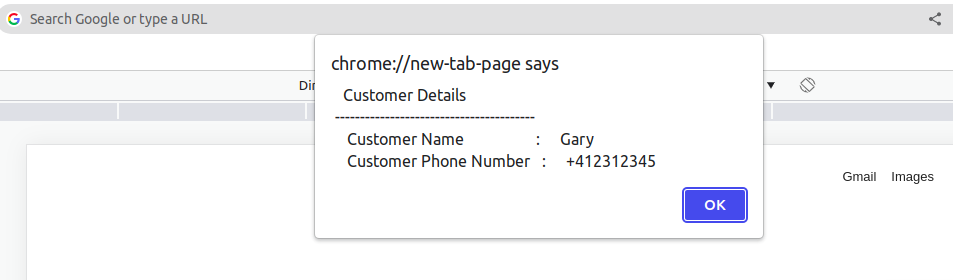
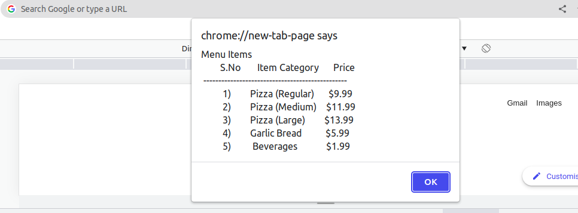
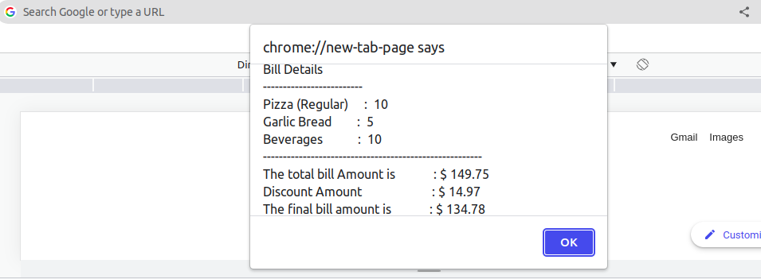

## Challenge - Calculate the Final Bill AMount Using JS Functions

### Problem Statement

Veggie-pizza delivers custom-made vegetarian pizzas along with other accompaniments. As a seasonal-promotional offer, the pizza joint is providing a discount of 10% on any bill that is greater than $50.​

Write a JavaScript program to store the personal details and the order details of a customer. Also, calculate the total bill amount for the items ordered and apply the discount (if applicable).​

Create various JavaScript functions to ​perform these operations.

#### Task - 1: Declare Global Variables

- Open the file `veggie-pizza-solution.js` to create the solution.​

- Create a JavaScript program with various global variables and initialize with sample values for the menu, customer and order details listed in the table.

**Menu Item**

|Menu Item|Price|
|---|---|
|Pizza(Regular)|$9.99
|Pizza(Medium)|$11.99
|Pizza(Large)|$13.99
|Garlic Bread|$5.99
|Beverages|$1.99

**Customer Details**

|Name|Values|
|-|-|
|customerName| 	Gary|	
|Customer PhoneNo| 	4123123435|	

**Order Details**
|Item Ordered|Number of Items|
|---|---|
|GarlicBread| 	5|
|Pizza(Regular)|10|
|Beverages |	10|

#### Task - 2: Display Customer and Menu Details

- Define a JavaScript function to display personal details of a customer using `alert` method in the below format.

- Define a function to display the menu details using `alert` method in the below format.

#### Task - 3: Retrieve the Price for the Items​

- Define a function which takes the size of pizza as parameter and returns the price based on the given size. ​

|Pizza Type|Pizza Size|
|--|--|
|Regualr|1
|Medium|2
|Large|2

- Define two functions, one to return the price of garlic bread and the other to return the price of beverages.

#### Task - 4: Calculate the Final Bill Amount​

- Define a function to calculate the subtotal of each item ordered.​
    - The function should take two parameters: number of items ordered and price of the item.​

- Define a function to calculate the total bill amount.​
    - The function should take three parameters: Pizza subtotal, Garlic Bread subtotal and Beverage subtotal​

- Define a function to calculate the final bill amount based on the discount available.​
    - The function should take one parameter: Total bill amount​
        - If the total bill is greater than or equal to $50, discount of 10% is applied on the total bill amount​

#### Task - 5: Display the Final Bill Details

- Define a function to display the customer final bill details as shown in the following format.​

**NOTE: The solution for this exercise should be provided in `veggie-pizza-solution.js` file.**
