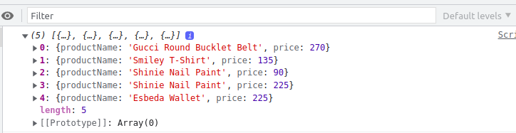
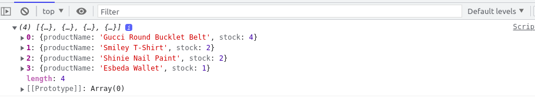
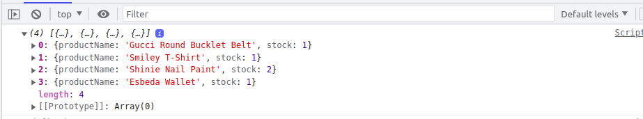

## Practice

This practice comprises of 4 exercises.

### Problem Statements

- The following products data can be used as reference while executing all the four practices. The same data is used for automated testing also.
- The products data is initialized as an array of objects where each object with product name and price as its properties in the file `data/products.js`.
- The table given below shows the product names and their respective prices.​

    | Product Name | Price(USD)|
   |---|---|
   | Gucci Round Bucklet Belt​ | 400​ | 
   | Gucci Round Bucklet Belt​ | 450​ |
   | Gucci Round Bucklet Belt​ | 300​ |
   | Gucci Round Bucklet Belt​ | 420​|
   | Smiley T-Shirt​ | 350​ |
   | Smiley T-Shirt​ | 150​ |
   | Shinie Nail Paint​ | 100​ |
   | Shinie Nail Paint​ | 250​ |
   | Esbeda Wallet​ | 250​ |

#### Practice 1 - Filter premium products

At Ricky's fashion store, you can't have discounts on premium products. Premium products are the ones whose price is greater than $300. ​

List the premium products after filtering based on the product price using the array filter method.

#### Task

- Use Array's filter arrow method to get the array of premium products whose price is greater than $300.

The solution for this exercise should be provided in `p1-submission.js` file.

The file is located inside the folder `p1-premium-products`.

#### Practice 2 - Apply Discount on Non-premium Products

The owner at Ricky's fashion store wants to give a discount of 10% on non-premium products to increase his sales.​

Help him apply a 10% discount on all non-premium products.

#### Task

- Use Array's filter arrow method to get the array of non-premium products whose price is less than or equal to $300. ​
- Use  Array's map method to apply a 10% discount on non-premium products to return the array of non-premium products with discounted price which has the following expected values.​

The solution for this exercise should be provided in `p2-submission.js` file.

The file is located inside the folder `p2-discounted-price`.

#### Practice 3 - Find the Inventory of Each Product

The shop owner at Ricky's fashion store wants to know the inventory of each product so that he can order the items which have gone below their reorder level.​

Get the inventory of each product using the Array's reduce method.

#### Task

- Use Array's reduce method to find the count of each product.​
- The reduce method should return array of objects where each object contains productName and stock as its properties and that has the following expected values.​

 
The solution for this exercise should be provided in `p3-submission.js` file.

The file is located inside the folder `p3-product-stock`.

#### Practice 4 - Implement Function chaining

Array operations can be chained together if they are performed on the same Array object to increase performance.​

Get the stock of each non-premium product using JavaScript function chaining strategy.​

#### Task

- Chain Array's filter, map and reduce methods to get the count of each non-premium products whose price is less than or equal to $300.

- The array of product details with product name and stock as its properties returned should correspond to the following expected values.

The solution for this exercise should be provided in `p4-submission.js` file.

The file is located inside the folder `p4-function-chaining`.

#### Submission Instructions

1. This is a test enabled practice, hence, the solution will have to ungdergo automated evaluation process.
    - For automated evaluation, the solution should be first tested locally and then on hobbes.
2. Steps to test the code locally:
    1. Ensure the solution code is provided in the specified files only.
    2. From the command line terminal, set the path to the folder containing cloned boilerplate code.
    3. Run the command `npm install` to install the dependencies.
    4. Run the command `npm run test` to test the solution locally.
    5. Ensure all the test cases are passing locally and then push the solution to git for automated testing on `hobbes`.
3. Steps to test the code on hobbes:
    1. Open the submission page at `https://codereview.stackroute.niit.com/#/submission`.
    2. Submit the solution.
    3. For the failed test cases, refactor the code locally and submit it for re-evaluation.
