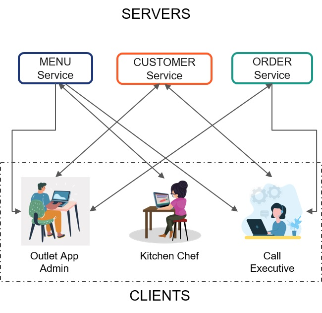

## Challenge - Create HTTP requests and record the responses for the Veggie-Pizza APIs

#### Context 

With the growing popularity, Veggie-Pizza outlet owners are getting a web application developed.​

The client-end of the web application is accessed by multiple teams of users (employees / customers).​

Different teams get different permissions to make requests.​

- E.g., the kitchen team can add, update, modify, delete menu details and view items ordered​.
- Call executives can work with customers and orders data​.
- Administrator has access to all the data.

At the server-end, separate services serve to the requests for menu items, customer details and orders.​

The diagram below explains how the various services at the server-end are accessed by different types of users from the client-end.​

#### Problem Statement

Create HTTP requests based on the requirements provided with the task details for menu, customers and orders APIs of the Veggie-Pizza.​

Record the responses for these requests in the given .csv files.​

**Note:** You may write the request URLs in the Postman app directly and test it.​

#### Prerequisite – Launch APIs Using json-server

- Start `json-server` and launch the APIs (menu, orders, customers) using json files provided in the `api-data` folder of the boilerplate.
- Each api should simultaneously work on different ports.
- Following are the suggested URLs for menu, customers and orders APIs respectively:
     - http://localhost:3000/menu
     - http://localhost:3001/customers
     - http://localhost:3002/orders
- Use the command `json-server –p <port-number> <filename.json>` to start the `json-server` on specified port.
    - Example: `json-server –p 3001 customers.json`

##### Data Structure of Veggie Pizza APIs​

**Menu data fields:​**

|Id ​|Category ​|Item Name​|Price ​|Cuisine
|--|--|--|--|--

**Customers data fields:**

|Id ​|Name ​|Email ​|Phone Number ​|Address |
|--|--|--|--|--

**Orders data fields:​**

|Id ​|Order Date ​|Items ​|Customer 
|--|--|--|--

​
**Note:** The values of the field 'Id' are specific to the respective data structure.​

For example, Id under menu data fields refer to the Id of the menu items. ​

#### Task 1 – HTTP Requests and Responses for Menu API​

- The administrator should be allowed to access the menu to: ​
    - Add a new menu item​
    - Modify details of an existing menu item​
- The Veggie-Pizza kitchen team should be allowed to access the menu to: ​
    - View all menu items​
- The call executive team should be allowed to access the menu for placing orders. The app should allow this team to: ​
    - View all menu items​
    - Filter out menu items by cuisine (Asian/Italian/Mexican/French)​
    - Filter out menu items by category (Starters/Beverages/Main Course/Desserts)​
    - View a specific menu item by its ID​
- List the request and response details for accessing menu in the `menu.csv` file.​

#### Task 2 – HTTP Requests and Responses for Customers API​

- The administrator and the call executive handle customers' data. The app should allow these users to: ​
    - View details of all customers​
    - Search customer by ID, name, email or phone​
    - Add details of a new customer​
    - Modify the contact details of an existing customer, based on customer’s request.​
- The administrator should also be allowed to delete customers.​
- For the stated requirements, identify the HTTP requests and responses for the Customers API.
- List the request and response details for accessing customers in the `customers.csv` file.​

#### Task 3 – List HTTP Request Response Details for Orders API

- The administrator and the call executives would be handling orders coming from customers over call. The app should allow these users to:​
    - Accept order details and save them​
    - Cancel an order​
    - Modify an order​
    - View all orders placed on a specific date​
    - View all orders placed by a specific customer​
- The administrator should also be allowed to view all orders for preparing reports for business analysis.​
- For the stated requirements, identify the HTTP requests and responses for the Orders API.
- List the request and response details for accessing menu in the `orders.csv` file.​

### Submission Instructions

1. This challenge would be manually evaluated.​
2. Ensure all the request URLs are tested using Postman before final submission.​
3. Push the code to git and share the link with mentor for manual evaluation.