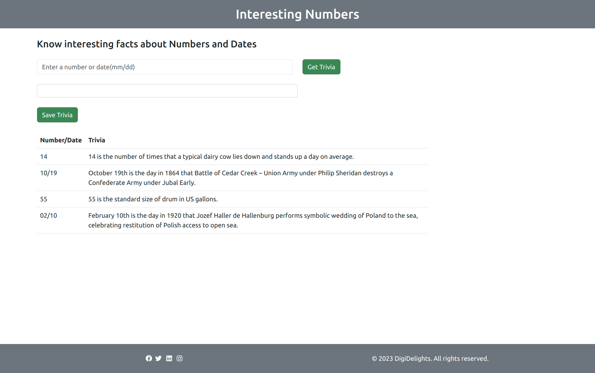
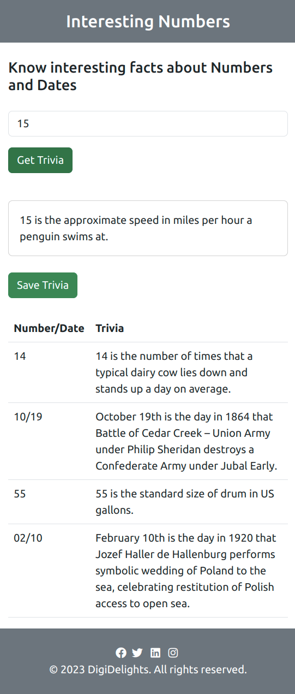

## Practice - DigiDelights - A Responsive and Interactive Web Page

### DigiDelights

In the world of numbers, every digit has a story to tell, a hidden fact to reveal, and a touch of fun to share. Exploring the enchanting realm of mathematics and discovering the intriguing side of numbers you never knew existed, is mind-boggling.

Join us on a journey where learning meets excitement, and where every visit promises to unravel the captivating mysteries of the numerical world. Let's dive into a universe where digits are no longer just numbers; they are your DigiDelights!

### Context

In a world where websites are made, imagine Alex, a tech whiz, creating the "DigiDelights" site. It's like a cool digital library filled with fun facts about numbers. The site is super easy to use, with a box to type numbers, buttons to get facts, and a place to see what you've found. When you put in a number and press the button, it's like opening a book, and you get a surprising number story.
 
But this site is even cooler because you can save your favorite stories for later. It's like keeping a special collection of awesome facts. And you can also see what other people have saved, so it's like a big, friendly club of number lovers having fun and learning together. So, Alex's site makes learning fun and easy!
 
### Problem Statement
 
Create a web page named DigiDelights that offers an engaging experience for users interested in exploring interesting number trivia. Users should be able to input a number, and the application should fetch captivating facts about that number from the `http://numbersapi.com/{number}` API. When the user enters a date in the mm/dd format, the application should fetch captivating facts about that date from the `http://numbersapi.com/{month}/{date}/date` API Moreover, users should have the ability to save their preferred trivia tidbits in a JSON format via the `http://localhost:3000/trivia` API for later access.

To promote a sense of community and enjoyable learning, users must be able to access a collection of saved trivia entries contributed by others, displayed in a user-friendly and interactive format. The goal is to build a frontend web application, as exemplified by the provided HTML and JavaScript code, that fulfills these objectives while delivering a delightful user experience for those keen on uncovering the intriguing universe of numbers.

To ensure responsiveness on various devices, incorporate a header and footer, and leverage the Bootstrap framework for this purpose.

### Sample Output

**Desktop View: Initial Load**

**Mobile View: Fetching data from API given a particular number or date**

### Instructions

- Use `ChatGPT` – the Generative AI Model for developing the `DigiDelights` web page.
- Fork the boilerplate into your own workspace. ​​​
- Clone the boilerplate into your local system. ​​​
- Open command terminal and set the path to the folder containing the cloned boilerplate code.​​​
- Open the folder containing the boilerplate code in VS Code.​​
- Ensure the CSS and JS codes are not embedded within the `index.html` file and instead are written externally.
- Give prompts to `ChatGPT` to generate code and develop the solution.
    
    **Note**: Maintain one conversation thread for entire development process.
- List down all the prompts in the `./prompts.md` file.
- Push the code to git and share the link with the mentor for manual evaluation.​

    **Note**: This practice would be manually evaluated and hence the boilerplate does not contain the test code.