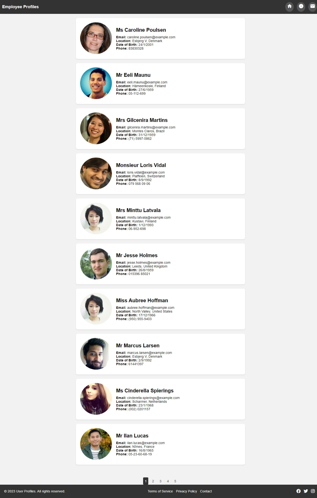

## Challenge - TalentGallery - A Responsive and Interactive Web Page

### TalentGallery

A talented team brings together individuals with diverse skills, fostering innovative solutions through varied perspectives. Talented team members excel in their roles, leading to efficient project completion and goal achievement.

Strong communication and cooperation among talented team members enhance problem-solving and project outcomes.
Talented individuals think creatively, contributing fresh ideas that drive continuous improvement and innovation.
The presence of talented colleagues fosters a motivating and positive atmosphere, boosting overall employee morale.

### Context

Having a page that lists profiles of talented team members is important for a few key reasons. It shows how skilled our team is, which builds trust with clients and partners. It also makes our team members feel appreciated and motivated. This page helps everyone know who's good at what, making it easier for us to work together and provide better results. Plus, it lets us keep up with changes and stay modern. Overall, the page helps us look good, work well, and stay updated.

The HR department at TechFusion Solutions has made the decision to create a webpage showcasing employee profiles, complete with their pictures. They have reached out to the IT division to develop a preliminary version of this webpage. As a software developer on the IT team, you have been tasked with the responsibility of generating a sample output using mock data. Due to the urgency of the situation, the webpage needs to be up and running soon, requiring the sample page to be created within a couple of hours.

### Problem Statement

Develop a web page titled TalentGallery that is both interactive and responsive and can be seamlessly integrated into the TechFusion Solutions corporate website. Employ the `https://randomuser.me/api/` URL to fetch data for 50 user profiles. Show details for 10 users on each page and incorporate a pagination feature for navigating through all employee profiles. 

Integrate a header and footer that adapt well to different devices and achieve this responsiveness using the Bootstrap framework.

### Sample Output

### Instructions

- Use `ChatGPT` – the Generative AI Model for developing the `TalentGallery` web page.
- Fork the boilerplate into your own workspace. ​​​
- Clone the boilerplate into your local system. ​​​
- Open command terminal and set the path to the folder containing the cloned boilerplate code.​​​
- Open the folder containing the boilerplate code in VS Code.​​
- Ensure the CSS and JS codes are not embedded within the `index.html`` file and instead are written externally.
- Give prompts to ChatGPT to generate code and develop the solution.
    
    **Note**: Maintain one conversation thread for entire development process.
- List down all the prompts in the `./prompts.md` file.
- Push the code to git and share the link with the mentor for manual evaluation.​

    **Note**: This practice would be manually evaluated and hence the boilerplate does not contain the test code.

